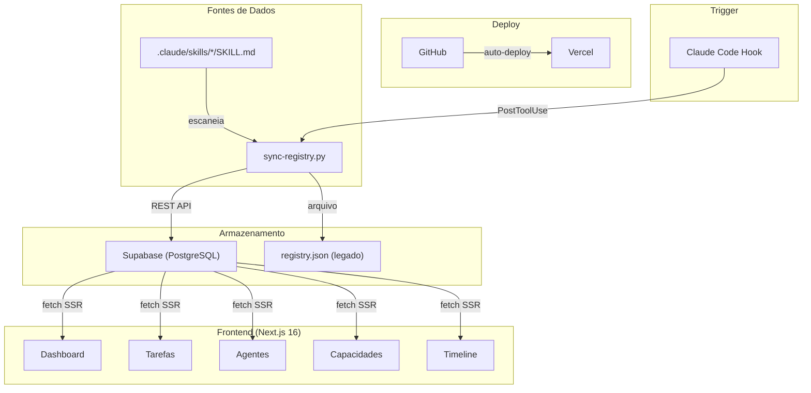

# Arquitetura — Taques Agents

## Diagrama

## Fluxo de dados

1. Usuário edita `SKILL.md` via Claude Code
2. Hook `PostToolUse` dispara `sync-registry.py`
3. Script escaneia skills, gera `registry.json` e sincroniza Supabase
4. Dashboard Next.js busca dados do Supabase via SSR (server-side rendering)
5. Páginas são dinâmicas (`force-dynamic`) — sempre dados frescos

## Protocolos implementados

| Protocolo | Status | Implementação |
|-----------|--------|--------------|
| **AG-UI** | v0.1 | Dashboard visual + HITL (aprovar/rejeitar tarefas) |
| **MCP** | Listagem | Inventário de MCPs conectados com status e ferramentas |
| **A2A** | Planejado | Registrado na activity_log, sem comunicação real entre agentes ainda |

## Decisões técnicas

- **Next.js 16 + Supabase** em vez de HTML estático: permite CRUD, filtros e dados persistentes
- **`force-dynamic`** em todas as páginas: dashboard precisa de dados sempre atualizados
- **Supabase anon key** (público): RLS configurado — read-only para tabelas sensíveis
- **`sync-registry.py` dual-write**: mantém registry.json (v1) e Supabase (v2) simultaneamente
- **Bun** como package manager: mais rápido que npm, sem problemas de cache
